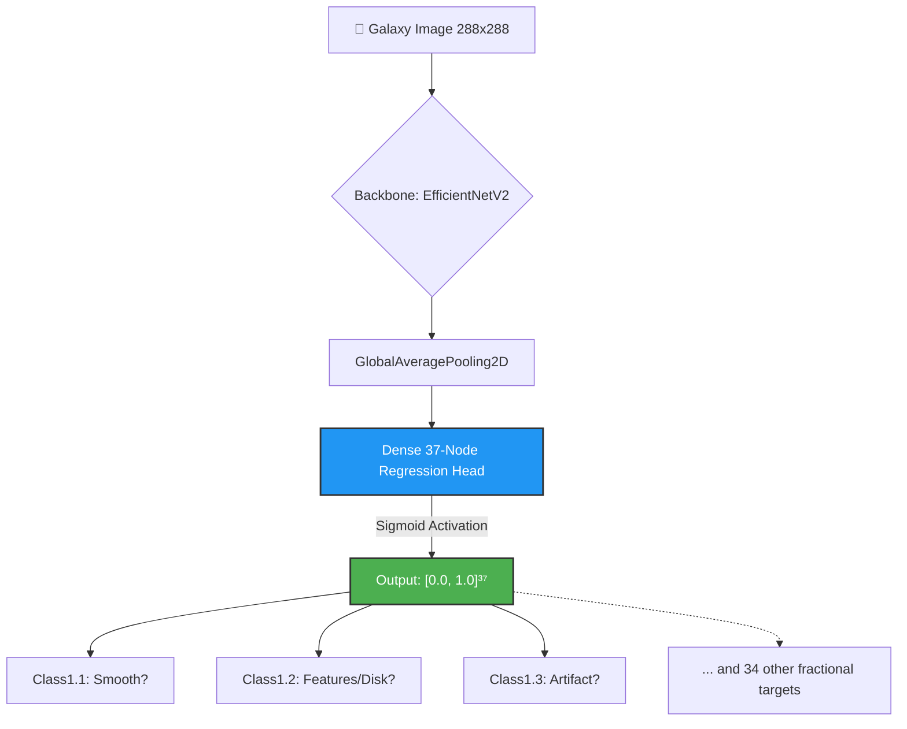
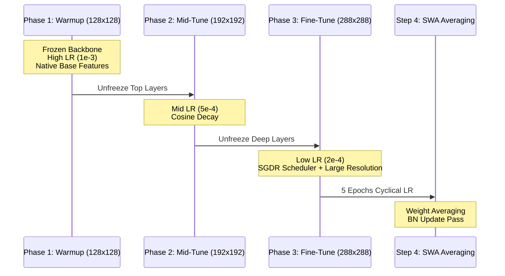

# 🌌 GalaxyNet: Technical Deep Dive (Regression Architecture)

Welcome to the official technical guide for GalaxyNet (Kaggle Version). This document serves as the primary source of truth for the **37-Node Unified Regression** architecture, uniquely designed to match the Kaggle *Galaxy Zoo* evaluation metric by predicting fractional human consensus distributions directly.

---

## 🏛️ System Architecture

GalaxyNet explicitly abolishes hard-threshold classification cascades (which enforce binary 'Spiral' or 'Elliptical' splits). Instead, it adopts a continuous target space, mapping input imagery to 37 floating-point values representing the probability fraction of crowd-sourced astronomist votes for 11 interconnected distinct morphological questions.

### The Unified Regression Head

> [!TIP]
> **Why Sigmoid for Regression?** 
> By terminating our Dense layer with a `sigmoid` activation rather than `linear`, we structurally enforce the predictions to exist strictly within the percentage bounding box `(0.0, 1.0)`. This stabilizes gradient convergence immediately by preventing out-of-bound errors.

---

## 🚀 Training Pipeline

We employ a **3-Phase Resolution Curriculum** combined with **Stochastic Weight Averaging (SWA)** to ensure maximum convergence stability without overshooting the local minimums.

### The Curriculum Flowchart

### Key Hyperparameters

| Configuration | Value / Formula | Rationale |
| :--- | :--- | :--- |
| **Loss Function** | Native RMSE / MSE | Aligns the optimization explicitly with Kaggle's evaluation logic. |
| **Resolution Scale** | 128px -> 192px -> 288px | Allows generic filters to solidify fast before extracting fine spiral arm textures. |
| **SGDR Schedule** | Restarts = 5, T_mul = 1.5 | Dislodges the model from saddle points at the massive 288px resolution geometry scale. |
| **SWA** | 5 Epochs | Averages out optimizer bouncing near the convergence terminal, typically yielding ~0.005 RMSE gain. |

---

## 🧪 Data Engineering & Augmentation

Predicting the continuous 37-node array requires preserving the original galaxy structural integrity exactly. We avoid aggressive augmentations like heavy cropping or elastic deformations, which destroy the physics of the galaxy.

### Applied Astronomy Augmentations

1. **Continuous Rotation**: 0° to 360° random rotations. Because galaxies have no implicit "up," this provides infinite unique spatial structural views without deleting pixels.
2. **Poisson CCD Noise**: Simulates authentic telescope sensor shot-noise.
3. **PSF Blur (Point Spread Function)**: Simulates the atmospheric degradation the Hubble Telescope encounters globally.

---

## 📊 Error Metric: TTA & RMSE

The loss is natively driven to reduce **Root Mean Squared Error (RMSE)** across the batch. 

### TTA-16 Logic (Test-Time Augmentation)
Since a galaxy looks identical from multiple rotated perspectives, we stabilize inference precision by averaging predictions across 16 different affine transforms:
- **4x Rotations** (0°, 90°, 180°, 270°)
- **2x Flips** (None, Horizontal)
- **2x Micro-Crops** 

Average RMSE is calculated globally:
$$ RMSE = \sqrt{ \frac{1}{N_{samples}} \sum \frac{1}{37} \sum_{i=1}^{37} (y_i - \hat{y}_i)^2 } $$

---

## 🛠️ Contributor Quickstart

### Project Layout
- `config.py`: Central hub for hyperparameters. Adjust resolutions, Unfreeze layers, and LRs here.
- `dataset.py`: The data-builder. Wraps Pandas reads and mapping functions into efficient multi-threaded `tf.data.Dataset` pipelines.
- `train.py`: The main loop orchestrator. 
- `losses.py`: Custom mathematical bounds mapping the Kaggle Leaderboard requirement.
- `evaluate.py`: The script to dump predictions and parse TTA validation matrices.

### Extending the Pipeline
1. **Backbone Alternatives**: Modify `architecture` in `config.py` (e.g., `EfficientNetV2B2`, `ConvNeXtTiny`).
2. **Image Scaling**: Increasing `image_size_phase3` past 288px will rapidly improve spatial reasoning on subtle irregular galaxies, but requires lowering `batch_size_phase3` to 8 or 4 to fit in memory.

---

> [!IMPORTANT]
> **State Note:** This repository explicitly dropped the legacy Classification Cascade structure in favor of Regression to directly target the Kaggle RMSE competition constraints, collapsing the codebase from 3,200 lines to ~1,250 highly performant lines.
