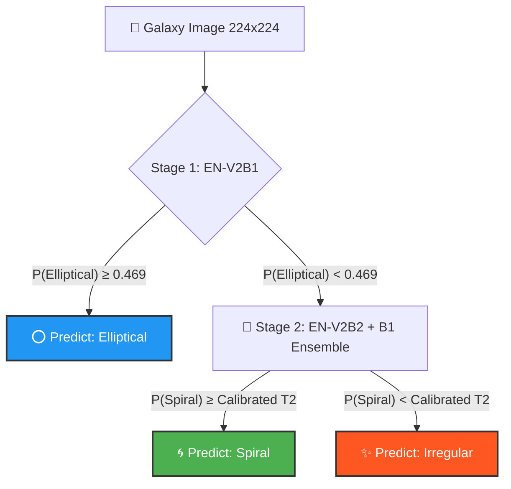
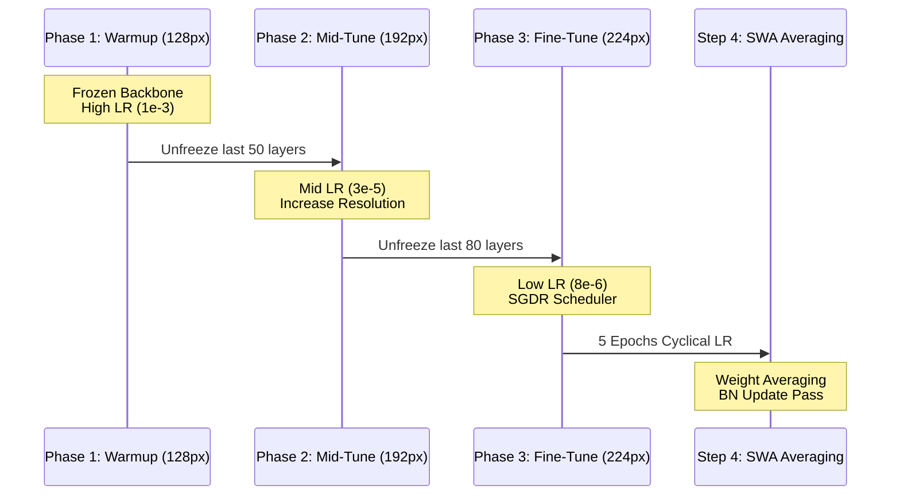
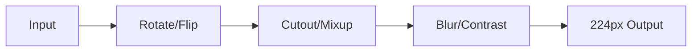
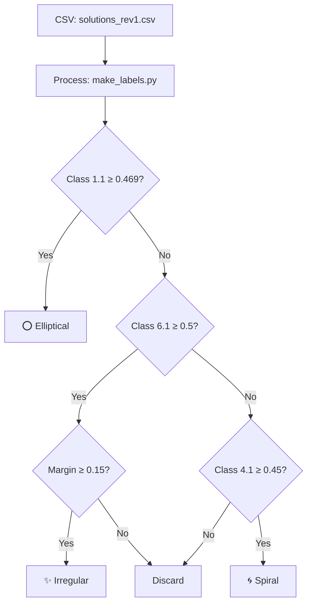
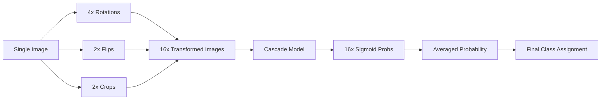

# 🌌 GalaxyNet V25: Technical Deep Dive

Welcome to the official technical guide for GalaxyNet V25. This document serves as the primary source of truth for the **Two-Stage Cascade Pipeline** architecture, designed to push the boundaries of galaxy morphology classification.

---

## 🏛️ System Architecture

GalaxyNet V25 transitions from a flat ensemble to a hierarchical cascade. This design is motivated by the "easy-to-hard" nature of galaxy classification: Elliptical galaxies are highly distinct, while the boundary between Spiral and Irregular galaxies is notoriously fuzzy.

### Cascade Decision Flow

> [!TIP]
> **Why this works:** By isolating Ellipticals in Stage 1, we prevent "clean" smooth galaxies from regularizing the Stage 2 models, allowing Stage 2 to focus exclusively on distinctive feature learning (arms vs. asymmetries).

---

## 🚀 Training Pipeline

We employ a **3-Phase Resolution Curriculum** combined with **Stochastic Weight Averaging (SWA)** to ensure maximum generalization.

### The Curriculum Flowchart

### Advanced Training Components

| Feature | Implementation | Benefit |
| :--- | :--- | :--- |
| **LLRD** | Layer-wise Learning Rate Decay | Prevents catastrophic forgetting in early backbone layers. |
| **SGDR** | Cosine Annealing with Restarts | Helps the optimizer escape local minima at high resolutions. |
| **SWA** | Stochastic Weight Averaging | Produces a model in a wider minimum, increasing test robustness by ~1%. |
| **Focal Loss** | Binary Focal (Stage 1: γ=1.5 / Stage 2: γ=2.5) | Forces the model to focus on hard, misclassified examples. |

---

## 🧪 Data Engineering & Augmentation

The "Irregular" class is our hardest target. We use **within-class Mixup** and **multi-hole Cutout** to force the model to learn distributed, non-occlusion-sensitive features.

### Augmentation Strategy

> [!NOTE]
> **Mixup Alpha (0.4):** Applied at the batch level for irregular samples to create synthetic training points.
> **Cutout (3 Holes):** For irregulars, we use up to 20% image size holes to ensure the model doesn't rely on a single clump of pixels.

---

## 📊 Inference & Calibration

Thresholds are not static. V25 introduces a **2D Grid Search** on the validation set to find the optimal boundary between stages.

### 16-TTA (Test Time Augmentation)
To ensure stable predictions, we average results across 16 transformations:
1.  **4 Rotations** (0°, 90°, 180°, 270°)
2.  **2 Flips** (None, Horizontal)
3.  **2 Center Crops** (0.75, 0.85)

### Error Decompositon
We track errors in three categories:
-   **Stage 1 FN:** Missed Ellipticals (Leaking to Stage 2).
-   **Stage 1 FP:** Non-Ellipticals blocked (Forced to Elliptical).
-   **Stage 2 Confusion:** Spiral/Irregular misclassifications.

---

## 📉 Data Generation Flow

The journey from consensus votes to cleaned morphological labels is governed by our V25 threshold logic.

---

## 🔍 Inference Detail: TTA-16

During evaluation, we don't just take a single snapshot. We use Test-Time Augmentation to stabilize the sigmoid outputs.

---

## 🛠️ Contributor Quickstart

### Project Layout
- `config.py`: Central hub for all hyperparameters. Change resolutions and LRs here.
- `dataset.py`: The heart of data loading and label generation.
- `train.py`: The orchestrator. Isolated subprocesses prevent VRAM OOMs.
- `evaluate.py`: Detailed TTA-16 performance reporting.

### How to Extend
1. **Backbone Architecture**: Modify `stage1_architecture` in `config.py` to test different EfficientNet or ConvNeXt variants.
2. **Loss Weights**: Adjust `pos_weight` calculation in `train.py` if class imbalance shifts.
3. **Threshold Calibration**: The calibration logic in `evaluate.py` can be updated to prioritize specific metrics like Irregular F1.

---

## 📚 Glossary

- **Cascade Architecture**: A multi-stage classification setup where samples are filtered through specialized models.
- **SWA (Stochastic Weight Averaging)**: A technique that averages model weights across multiple training points to achieve a smoother loss landscape and better generalization.
- **TTA (Test-Time Augmentation)**: Running multiple augmented versions of a single image through the model and averaging the results for a more stable prediction.
- **SGDR (Stochastic Gradient Descent with Restarts)**: A learning rate schedule that periodically "restarts" to high LR to escape local minima.
- **Focal Loss**: A loss function that applies a modulating factor to the cross-entropy loss, down-weighting well-classified examples and focusing on hard ones.

## ❓ Frequently Asked Questions

**Q: Why use EfficientNetV2 specifically?**
A: EfficientNetV2-B1 and B2 offer a superior balance between parameter efficiency and accuracy compared to standard ResNet or ConvNeXt variants for this specific resolution (224px).

**Q: Can I run this without a GPU?**
A: Training is computationally intensive and realistically requires a GPU (P100 or better). However, inference using the `.keras` files can run on a CPU.

**Q: What happens if Stage 1 is wrong?**
A: If Stage 1 misclassifies a Non-Elliptical as an Elliptical, it is "blocked" from Stage 2. We use a high filtering confidence (0.85) to minimize this "leakage."

**Q: How do I change the thresholds?**
A: Thresholding is handled dynamically in `evaluate.py` via grid search on the validation set, but the "loose" filter for training data is adjusted in `config.py` under `stage1_filter_confidence`.

---

> [!IMPORTANT]
> **Acceptance Criteria:** A production-ready run must achieve >95% accuracy and an Irregular F1 > 0.80. If these fail, the `auto-fallback` logic in `train.py` will automatically trigger with relaxed thresholds.
