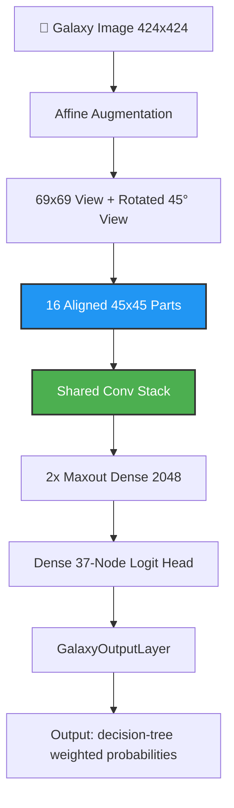
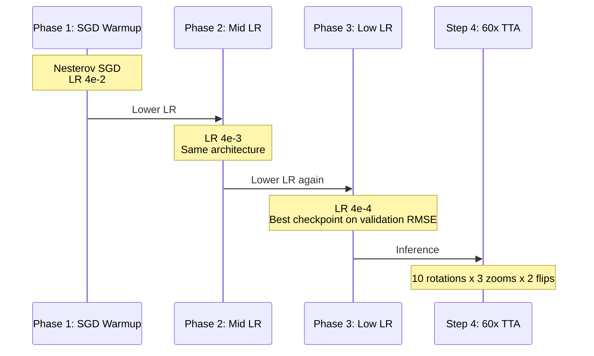

# 🌌 GalaxyNet: Technical Deep Dive (Regression Architecture)

Welcome to the official technical guide for GalaxyNet (Kaggle Version). This document serves as the primary source of truth for the current **Benanne-inspired 37-node regression** pipeline, designed to match the Kaggle *Galaxy Zoo* evaluation metric by predicting fractional human consensus distributions directly.

---

## 🏛️ System Architecture

GalaxyNet explicitly abolishes hard-threshold classification cascades (which enforce binary 'Spiral' or 'Elliptical' splits). Instead, it adopts a continuous target space, mapping input imagery to 37 floating-point values representing the probability fraction of crowd-sourced astronomist votes for 11 interconnected distinct morphological questions.

### The Benanne-Inspired Regression Head

> [!TIP]
> **Why a custom output layer?**
> The final 37 outputs are not independent. `GalaxyOutputLayer` first normalizes each question block, then reapplies the Galaxy Zoo decision-tree weights so the model predicts valid weighted probabilities directly instead of learning the hierarchy only through the loss.

---

## 🚀 Training Pipeline

We employ a **3-phase learning-rate schedule** with a TensorFlow port of benanne’s view/part architecture to keep the optimization regime close to the winning solution while remaining Kaggle-script friendly.

### The Training Flowchart

### Key Hyperparameters

| Configuration | Value / Formula | Rationale |
| :--- | :--- | :--- |
| **Loss Function** | Native RMSE / MSE | Aligns the optimization explicitly with Kaggle's evaluation logic. |
| **Input Geometry** | 2 views -> 16 parts | Ports the strongest inductive bias from the winning benanne model into TensorFlow. |
| **Optimizer** | Nesterov SGD | Matches the original winning training regime more closely than the earlier Adam fine-tuning setup. |
| **Output Layer** | `GalaxyOutputLayer` | Predicts valid decision-tree-weighted probabilities directly. |

> [!NOTE]
> Two TensorFlow-side additions depart from the 2014 original: inputs are rescaled to
> `[0, 1]` before the convnet, and each convolution is followed by BatchNorm
> (`Conv → BatchNorm → ReLU`). Both stabilize from-scratch training under the high warmup
> learning rate and were not part of benanne's original network.

---

## 🧪 Data Engineering & Augmentation

Predicting the continuous 37-node array requires preserving the original galaxy structural integrity exactly. We avoid aggressive augmentations like heavy cropping or elastic deformations, which destroy the physics of the galaxy.

### Applied Astronomy Augmentations

1. **Affine Rotation / Zoom / Translation**: Direct port of the winning augmentation family.
2. **Random Horizontal Flip**: Included exactly as in the benanne training logic.
3. **Color Perturbation**: Krizhevsky-style single-axis color noise using benanne’s stored channel weights.

---

## 📊 Error Metric: TTA & RMSE

The loss is natively driven to reduce **Root Mean Squared Error (RMSE)** across the batch. 

### TTA-60 Logic (Test-Time Augmentation)
Since a galaxy looks identical from multiple rotated perspectives, we stabilize inference precision by averaging predictions across 60 deterministic transforms:
- **10x Rotations** (0° to 324° in 36° steps)
- **3x Zooms** (`1`, `1/1.2`, `1.2`)
- **2x Flips** (None, Horizontal)

Average RMSE is calculated globally:
$$ RMSE = \sqrt{ \frac{1}{N_{samples}} \sum \frac{1}{37} \sum_{i=1}^{37} (y_i - \hat{y}_i)^2 } $$

---

## 🛠️ Contributor Quickstart

### Project Layout
- `config.py`: Central hub for hyperparameters. Adjust resolutions, Unfreeze layers, and LRs here.
- `dataset.py`: The data-builder. Wraps Pandas reads and mapping functions into efficient multi-threaded `tf.data.Dataset` pipelines.
- `train.py`: The main loop orchestrator. 
- `losses.py`: Custom mathematical bounds mapping the Kaggle Leaderboard requirement.
- `evaluate.py`: The script to dump predictions and parse TTA validation matrices.

### Extending the Pipeline
1. **Backbone Alternatives**: Modify `architecture` in `config.py` (e.g., `EfficientNetV2B2`, `ConvNeXtTiny`).
2. **Architecture Variants**: The next realistic path is not a single bigger image size; it is multiple trained variants of the benanne-style model and validation-set blending.

---

> [!IMPORTANT]
> **State Note:** This repository dropped the earlier classification-cascade structure in
> favor of direct regression against the Kaggle RMSE metric. The pipeline is now a single
> set of modules (`config`, `dataset`, `model`, `losses`, `train`, `evaluate`, `utils`)
> merged into one Kaggle script by `scripts/consolidate.py`.
